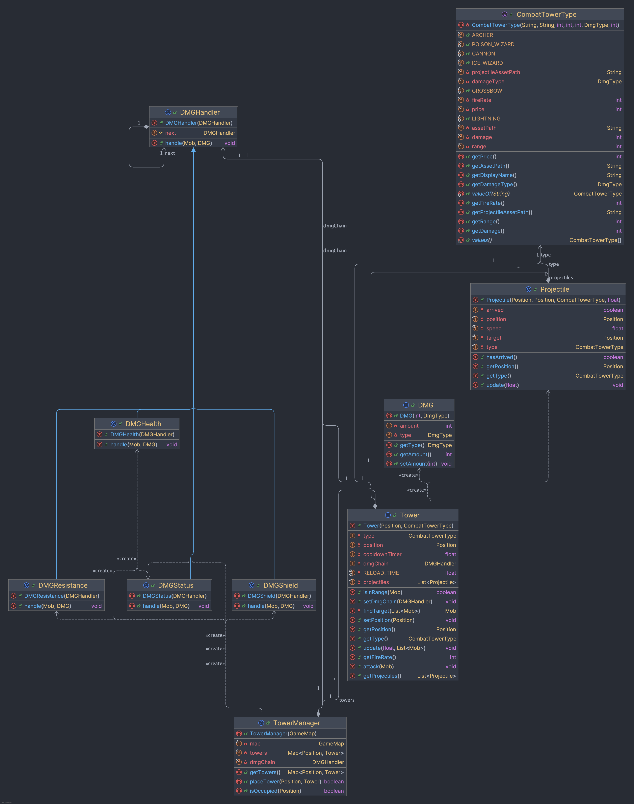

# Introduction

Ce projet est un jeu de tower defense développé en Java, conçu pour démontrer une implémentation du patron de chaîne de responsabilité. Le but du joueur est de défendre son château en plaçant des tours le long du chemin emprunté par des vagues d'ennemis (mobs), chaque tour infligeant des dégâts d'un type particulier aux créatures à sa portée.

# Instructions de compilation

Le projet utilise **Gradle** avec son **wrapper** inclus dans le dépôt. Il n'est donc pas nécessaire d'installer Gradle manuellement : il suffit d'utiliser les scripts fournis (`./gradlew` sur macOS/Linux ou `gradlew.bat` sur Windows).

## Prérequis

- **Java 21** : le projet est configuré pour compiler et s'exécuter avec cette version.
- **Aucun IDE obligatoire** : l'IDE peut être utilisé pour le développement, mais la compilation et l'exécution peuvent se faire en ligne de commande.
- Une connexion Internet peut être nécessaire au premier lancement afin que Gradle télécharge les dépendances du projet.

## Compilation

Depuis la racine du projet, les commandes principales sont :

```bash
./gradlew build
```

Cette commande compile l'ensemble du projet, exécute les tâches nécessaires et vérifie que les sources Java sont valides.

Pour lancer directement l'application :

```bash
./gradlew :lwjgl3:run
```

Sur Windows, il faut utiliser :

```bat
gradlew.bat build
gradlew.bat :lwjgl3:run
```

Si le script n'est pas exécutable sur macOS ou Linux, il faut d'abord lui donner les droits d'exécution une seule fois :

```bash
chmod +x gradlew
```

# Choix d'implémentation

## Gestion des tours
La classe `TowerManager` centralise la gestion des tours posées sur la carte. Elle conserve l'ensemble des tours dans une `Map<Position, Tower>` et expose une méthode `placeTower` qui valide chaque placement : la position doit se trouver sur un emplacement de tour (`tower slot`) libre de la carte, sinon la pose est refusée. 

### Les tours (`Tower`)
Chaque tour posée est une instance de la classe `Tower`. Une tour connaît sa position sur la carte et son type, et à chaque mise à jour elle cherche un ennemi à sa portée (`isInRange`) puis l'attaque si son temps de rechargement le permet. La cadence de tir est gérée par un compteur de rechargement (`cooldownTimer`) dérivé de la cadence du type de tour : plus la cadence est élevée, plus l'intervalle entre deux tirs est court. Lorsqu'une tour tire, elle inflige les dégâts à la cible (via la chaîne de responsabilité) et engendre un projectile visuel se dirigeant vers l'ennemi.

### Les types de tours (`CombatTowerType`)
Les caractéristiques propres à chaque tour  sont regroupées dans l'énumération `CombatTowerType`, qui décrit les six tours disponibles : `ARCHER`, `CANNON`, `CROSSBOW`, `ICE_WIZARD`, `LIGHTNING` et `POISON_WIZARD`. Chaque valeur de l'énumération fixe les dégâts, la portée, la cadence de tir, le type de dégât infligé (`DmgType`), le prix d'achat, ainsi que les chemins vers le sprite de la tour et celui de son projectile. Cette approche permet d'ajouter ou d'ajuster une tour en un seul endroit, sans toucher à la logique de combat, et facilite l'affichage de ces informations dans l'interface (nom lisible, prix, etc.).

### Les projectiles (`Projectile`)
Lorsqu'une tour tire, elle crée un `Projectile` chargé de représenter visuellement le tir. Le projectile garde une copie de sa position de départ et de la position cible  et avance à chaque mise à jour vers sa cible à une vitesse proportionnelle à la cadence de la tour. Une fois la cible atteinte, il est marqué comme « arrivé » (`hasArrived`) et la tour le retire de la liste des projectiles en vol. 

## Dégats - Pattern chaîne de responsabilité
Le projet utilise le patron chaîne de responsabilité pour gérer l’application des dégâts aux enmies (mobs) de manière modulaire et extensible. Lorsqu’une créature subit un dégât, celui-ci traverse une chaîne de gestionnaires spécialisés, chacun effectuant sa responsabilité spécifique :
1. DMGShield : Vérifie et traite les dégâts bloqués par le bouclier d’un enmie
2. DMGStatus : Applique les effets de statut selon le type de dégât (ralentissement, poison, etc.)
3. DMGResistance : Réduit les dégâts si la créature possède une résistance au type infligé
4. DMGHealth : Applique finalement les dégâts à la santé de la créature
   Chaque gestionnaire (héritage de DMGHandler) peut traiter sa partie puis déléguer au suivant, formant une chaîne flexible où de nouveaux types de dégâts ou d’effets peuvent facilement être ajoutés sans modifier le code existant.

La chaîne est assemblé dans le constructeur de `TowerManager` , puis passé à tour au moment de sa pose. Les tours reçoivent ainsi une référence partagée vers la chaîne et se contentent de lui déléguer le calcul des dégâts lorsqu'un ennemi entre à leur portée.

## Gestion des ennemis (Mobs)
La gestion des ennemis (mobs) est centralisée par la classe `MobManager`, qui crée et gère les vagues de créatures. Chaque mob est une instance de la classe `Mob` qui encapsule l'état et le comportement d'une créature individuelle. Les mobs suivent le chemin défini sur la carte et peuvent être attaqués par les tours.

### Les mobs (`Mob`)
Un mob représente une créature ennemie avec les caractéristiques suivantes :
- **Position** : Le mob occupe une position sur la carte et se déplace le long du chemin.
- **Santé** : Chaque mob possède une santé initiale (`health`) et une santé actuelle (`currentHealth`) qui diminue lorsqu'il subit des dégâts. Le mob est éliminé quand sa santé atteint zéro.
- **Type** : Les neuf types disponibles (`BAT`, `BIG_SLIME`, `DEMON`, `GHOST`, `GOBLIN`, `KING_SLIME`, `NORMAL_SLIME`, `SKELETON`, `ZOMBIE`) permettent de définir quel asset nous allons utiliser pour l'affichage.
- **Vitesse de déplacement** : Contrôlée par un `moveInterval` et un compteur de rechargement (`moveCooldown`), elle détermine la fréquence à laquelle le mob se déplace sur la carte.
- **Résistances** : Un mob peut avoir des résistances à un ou plusieurs types de dégâts (`DmgType`), ce qui réduit l'impact des attaques correspondantes via le handler `DMGResistance`.
- **Bouclier** : Un booléen indiquant si le mob est protégé par un bouclier. Le handler `DMGShield` absorbe complètement un dégât si le mob a un bouclier actif, puis le désactive.

### Le gestionnaire de mobs (`MobManager`)
Le `MobManager` est responsable de la création et de la gestion des vagues d'ennemis.

#### Création de vagues (`createWave`)
La méthode `createWave` réinitialise la liste des mobs et crée une nouvelle vague selon les paramètres suivants :
- **Nombre de mobs communs** : Défini par `nbMob - NB_BOSS` (où `NB_BOSS = 2`), créés avec des stats de base.
- **Mobs boss** : Le `MobManager` ajoute toujours deux boss à chaque vague. Ces boss sont des créatures renforcées avec :
  - Une **santé doublée** : `health * BOSS_FACTOR` (où `BOSS_FACTOR = 2`)
  - Une **vitesse doublée** : `speed * BOSS_FACTOR`.
  - Un **bouclier actif** (`shield = true`), absorbant le premier dégât reçu
  
Chaque mob, qu'il soit commun ou boss, est assigné :
- Un **type aléatoire** parmi les neuf types disponibles
- Une **résistance aléatoire** à l'un des cinq types de dégâts
- Une **vitesse de base** assignée à 4.0 par défaut pour les mobs communs

### Types de dégâts et leurs effets
Lorsqu'un mob subit des dégâts, les handlers de la chaîne de responsabilité appliquent des effets en fonction du type (`DmgType`) :

- **ARROW, GLACE, LIGHTNING** : Ralentissent le mob en doublant son `moveInterval`. Le mob se déplace deux fois plus lentement.
- **EXPLOSION** : Ne produit aucun effet de statut supplémentaire mais inflige les dégâts instantanément.
- **POISON** : Élimine une résistance aléatoire du mob. Si le mob n'a plus de résistances, cet effet n'a aucun impact.

## Génération de la carte

La génération de la carte est centralisée dans la classe `MapGenerator`. Lorsqu'une nouvelle carte doit être créée, cette classe récupère d'abord la configuration associée à la difficulté demandée via `MapDifficulty`. Cette configuration définit principalement la taille de la carte ainsi que certaines limites liées au placement des tours. Le générateur crée ensuite une instance de `GameMap`, vide au départ, dans laquelle toutes les cases sont initialisées en herbe.

La première étape concrète de la génération est réalisée par `PathGenerator`. Cette classe construit un unique chemin continu entre un point de départ et un point d'arrivée. Pour cela, elle utilise un seul objet `Random`, ce qui permet de garder une génération reproductible à partir d'une seed. Le chemin est tracé directement sur la carte en remplaçant certaines cases `GRASS` par des cases `ROAD`, puis les positions de début et de fin sont enregistrées dans `GameMap`. Le trajet est composé de segments horizontaux et verticaux, ce qui garantit un chemin simple, lisible et sans boucle.

Une fois le chemin créé, `TowerSpotGenerator` se charge de placer les emplacements de tours. Cette classe parcourt les cases voisines de la route afin de repérer les positions candidates qui sont adjacentes au chemin. Les cases déjà occupées, trop proches du début ou de la fin, ou situées dans l'empreinte du château sont exclues. Les candidats restants sont mélangés, puis un sous-ensemble est retenu en respectant une distance minimale entre deux emplacements. Les positions sélectionnées deviennent alors des cases `TOWER_SPOT` et sont stockées dans la carte.

En résumé, la génération suit un ordre simple : d'abord la carte vide, ensuite le chemin, puis les emplacements de tours. Chaque étape repose sur le résultat de la précédente, ce qui permet d'éviter de générer des éléments incohérents.

## Affichage et rendu

L'affichage est principalement géré par `TextureManager`, `MapRenderer` et `FirstScreen`. `TextureManager` a pour rôle de charger les assets du jeu et de les découper si nécessaire en différentes frames. Il centralise ainsi l'accès aux textures de l'herbe, des routes, du château, des tours, des mobs, des projectiles et des décorations.

`MapRenderer` s'occupe du dessin de la carte elle-même. À chaque frame, il commence par calculer la taille des tuiles et la position de la grille à l'écran en fonction des dimensions de la fenêtre. Ensuite, il dessine les éléments dans un ordre précis : l'herbe en fond, les routes, les emplacements de tours, les décorations, puis le château. Les tours placées, les mobs et les projectiles sont dessinés par-dessus la carte.

Pour les routes, `MapRenderer` observe les cases voisines afin de choisir le bon sous-sprite du tileset. Cela permet d'afficher automatiquement les portions droites et les virages en fonction de la forme réelle du chemin généré. Le château est dessiné à partir de sa position d'arrivée, avec une largeur et une hauteur définies dans `GameMap`. Les décorations sont affichées plus petites que la taille d'une tuile afin de rester visibles sans masquer complètement le décor de base.

Enfin, `FirstScreen` orchestre le tout : elle déclenche la génération de la carte, initialise les gestionnaires nécessaires, traite les entrées clavier et souris, puis appelle les différentes étapes de rendu. Cette séparation permet de garder la logique de génération, le rendu graphique et les interactions utilisateur dans des classes distinctes, ce qui rend le projet plus lisible et plus simple à faire évoluer.


# Diagramme de classes

Voici le diagramme de classes qui se concentre sur la partie du projet qui met en œuvre le patron de chaîne de responsabilité pour la gestion des dégâts. Il illustre les relations entre les classes principales impliquées dans le traitement des attaques des tours sur les mobs, ainsi que la structure de la chaîne de responsabilité.


